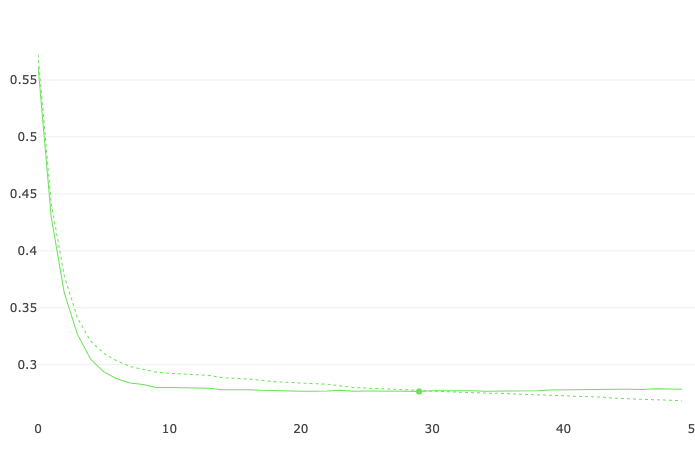

# referral_association_rule

## Problem Statement
Define scores for referrals who have been giving fruitful refers. Fruitful refers translate to the performance of the referees who joined by referral. If a client has a higher trade activation ratio for his/her refers, his/her score must be higher.

## Features

* Age
* income_per_annum
* occupation
* Z20
* app_status
* E2 channel
* iskarvy
* KRA

========= trade behaviour of referrer =========
* number of logins in last year
* num_trades in last year
* months since last login
* months since last trade

========= trade behaviour of referees =========
* average num_logins per month post account open
* average num_trades per month post account open

## Data matrix
* num rows: 32923
* num features: 13

## Target variable
predefined target variable was not available.Target variable for client was not computed by taking the ratio of number of trade activations to number of refers by a referrer. The computed value is binned into 4 labels and the model is intended to train as a multiclassification problem. Number of rows in each class is distributed as:
* 1    25196
* 2     2240
* 3     5485
* 4        2

## Dataset analysis
dataset_size: 33386
num_features:
target_feature:
* There was not predefined target variable, target variable for each referrer is defined by the trading behaviur of the referees.
* ratio of num_trading_referees/num_refers is taken as target variable
* the fraction values is binned into 4 categories and the model was modified as a mulitclassification problem.
  (-0.001, 0.333]    25556, labelled as 1
  (0.592, 1.0]        5563, labelled as 2
  (0.333, 0.592]      2265, labelled as 3
  (1.0, 2.0]             2, labelled as 4
  
## Model used: 
Catboost

## Training 
* model is trained on catboostclassifier on default hyperparameters for 75b iterations
* Logloss over iterations is shown below in the plot

## Results and accuracy
* accuracy: 
  * training: 0.883
  * validation: 0.890
* multiclass logloss:
  *  training: 0.277
  *  validation: 0.276

  

